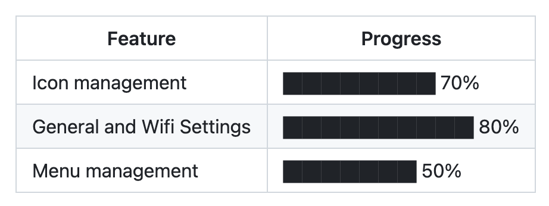

# md-utility/generateMDBarChart

`md-utility` is a Markdown utility.

## Function: `generateMDBarChart`

### Description

The `generateMDBarChart` function takes a CSV data string and generates a Markdown bar chart for visualizing progress or any other data.

### Usage

```javascript
const { generateMarkdown } = require("md-utility");

const csvData = `Feature,Progress
Icon management,70
General and Wifi Settings,80
Menu management,50`;

const markdownString = generateMarkdown(csvData);
console.log(markdownString);
```

#### Output


